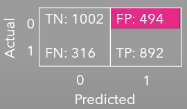
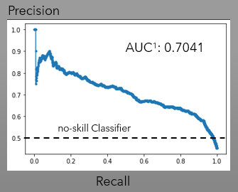
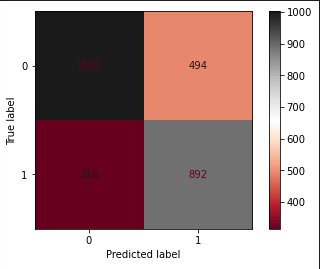

# ML Sample Code

This repository is for a Machine Learning (ML) Python code. The objective of this Sample ML code is to predict 1-period in advance market changing conditions (Squueze and Bulge ).

## Table of Content

* Definition of the ML model Market conditions
    - Squeeze 
    - Bulge
* Designed Sample ML model
* Results
* Improvements
* Machine Learning Squeeze code
* External resources 

## Definition of the ML model Market conditions

The market has 2 stages of activity: Agitation and Calmnes. During the Calm period, the asset moves little, in sideways direction (no-trending). There is a "pause" on the trend. During this no-trending situation the market is said to be in a "squeeze".


On the other hand, when an asset is rapidly moving or agitated, the asset is trending (either up or down), the asset is considered to be in a "bulge".

The Bulge and Squeeze concept is intended to assess the market agitation or calmness. It doesn't predict direction.

The ML squeeze model that I developed is intented to be used **in combination with directional ML models that I created and are not presented on this sample code**. 

## Designed Sample ML Model

The sample code presented here, predicts with 1-period ahead the stage of the asset in a "squeeze". 

The market has been objectively classified as a bulge or a squeeze based on a combination of two technical analysis trading indicators: bollinger bands (https://www.bollingerbands.com/) and Keltner Channel (https://investopedia.com/terms/k/keltnerchannel.asp) that assess market volatility.

The designed model consists of 11-feature Random Forest Classifier that compares Close price with bands created by these two indicators. Both indicators use 20 period length, 2 Standard deviations for the Bollinger Bands, and 2 ATR (Average true range) for the Keltner Channel.

## Results

  The Squeeze Random Forest Precision is 64%, however the specificity turns out of 67%. 

 The Precission-Recall curve for the Squeeze Rqandom Forest Model surpassed the minimum threhold of 0.5 (no-skill classifier) with an Area Under the Curve (AUC) of 0.70. 

 

 Since specificity needs to be increased (above 80%), this model needs more analysis and adding more features to increase specificity thus reducing False Positives.

 ## Improvements

 The Sample code has been improved to increase specificity and accuracy. Some of the implemented changes are:
 * Increase time frame
 * Increase data rows
 * Modified to model market stage behavior in Futures assets: Crude Oil, Natural Gas, Heating Oil (Diesel), Gasoline (RBOB), Soybean Meal, Soybean, Wheat, Corn, British Pounds.
 * Change Bollinger Bands and keltner Channel indicators settings: period lengths and standard deviations parameter.
 * Develop a model that predicts the Bulge 
 * Added features to the ML Model predictor. 

<p style="text-align: center;"> <font size="4"> Squeeze ML Classifier Confusion Matrix </font></p>
</font></p>
<p align="center">
  
</p>


## ML Squeeze Code

```
ts_file_df = pd.read_csv(csv_path, parse_dates=[['Date', 'Time']])

ts_file_df.set_index(pd.to_datetime(ts_file_df['Date_Time'], infer_datetime_format=True), inplace=True)

ts_file_df.drop(columns=['Date_Time', 'MidLine.1'], inplace=True)
x_var_list = ['Open', 'High', 'Low', 'Close', 'Up', 'Down', 'kcup', 'kclo', 'MidLine', 'bbup', 'bblo', 'FastEMA', 'SlowEMA']

ts_file_df[x_var_list] = ts_file_df[x_var_list].shift(1)

training_start = ts_file_df.index.min().strftime(format='%Y-%m-%d')

training_end = '2019-01-11'

# Construct test start and test end dates

testing_start = '2019-01-12'
testing_end = '2019-06-12'

# Construct validating start and validating end dates

vali_start = '2019-06-13'
vali_end = '2020-01-12'

# Construct the X_train and y_train datasets
X_train = ts_file_df[x_var_list][training_start:training_end]
y_train = ts_file_df['squeeze'][training_start:training_end]

# Construct the X test and y test datasets

X_test = ts_file_df[x_var_list][testing_start:testing_end]
y_test = ts_file_df['squeeze'][testing_start:testing_end]

# Construct the X valid and y validation datasets

X_vali = ts_file_df[x_var_list][vali_start:vali_end]
y_vali = ts_file_df['squeeze'][vali_start:vali_end]

# StandardScaler 
from sklearn.preprocessing import StandardScaler
from sklearn.model_selection import train_test_split
from sklearn.metrics import confusion_matrix, accuracy_score, classification_report

# Creating the StandardScaler instant 
scaler = StandardScaler()

# Feeding StandardScaler for X_train, X_test, X_vali
X_scaler_train = scaler.fit(X_train)

# Scaling the data 
X_train_scaled = X_scaler_train.transform(X_train)

X_test_scaled = X_scaler_train.transform(X_test)

X_vali_scaled = X_scaler_train.transform(X_vali)

# Fit SKLearn regression with training datasets:
model = RandomForestClassifier(n_estimators=1000, max_depth=25, random_state=1)
model.fit(X_train_scaled, y_train)

# Make predictions of "y" values from the X_test dataset
predictions = model.predict(X_test_scaled)

# Assemble actual y_test with predicted values

compare_predict_df = y_test.to_frame()
compare_predict_df["predict_squeeze"] = predictions

# Save the pre-trained model
from joblib import dump, load
dump(model, 'random_forest_model_scaled_squeeze.joblib')

# Calculating the confusion matrix
cm = confusion_matrix(y_test, predictions)
cm_df = pd.DataFrame(cm)

# Calculating the accuracy score
acc_score = accuracy_score(y_test, predictions)
acc_score

# Display results
print("Confusion Matrix")
display(cm_df)
print(f"Accuracy Score {acc_score}")
print(classification_report(y_test, predictions))

from sklearn.metrics import ConfusionMatrixDisplay
cm_display = ConfusionMatrixDisplay(cm).plot(cmap='RdGy')
```


    
